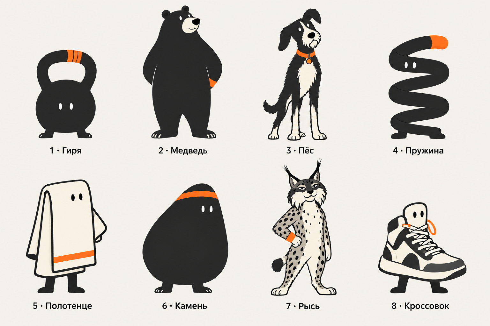

# Handoff: главный маскот — выбранная рысь №7

25 сентября 2026. Проект `trainerApp`.

## Решение пользователя

Главным маскотом приложения выбрана **рысь №7 с листа восьми разных маскотов**.
Решение зафиксировано в [MASCOT-DECISION.md](MASCOT-DECISION.md).

Референс: [eight-mascots.png](mascot-casting-2026-09-25/eight-mascots.png).
Нижний ряд, третья колонка; подпись «7 · Рысь».



SHA-256 исходного листа: `1c6b121a8fa80e68ba4060a6431bbe8c6130b56652e292f583b0646d5e0da239`.
Для работы использовать файл из репозитория; localhost-ссылка и кеш генератора не являются
единственным местом хранения референса.

## Что именно сохранить

- **Силуэт:** взрослая антропоморфная рысь, вытянутый корпус, обычная комплекция,
  устойчивые лапы, короткий хвост. Без увеличения головы до детских пропорций.
- **Голова:** высокие уши с чёрными кисточками, широкие щёки с характерным контуром,
  светлая морда, тёмный нос.
- **Лицо:** выразительные миндалевидные глаза с веками, небольшая улыбка и спокойная
  уверенность. Это существенная часть выбранного характера; не заменять глаза точками.
- **Рисунок тела:** серые и кремовые области, заметные чёрные пятна разного размера.
  Сохранить их как часть образа. Удаление пятен не является нейтральным упрощением.
- **Акцент:** оранжевый напульсник на лапе. В исходной позе эта лапа опирается на бедро.
- **Подача:** контурная иллюстрация с плоскими цветовыми областями и деталями морды/шерсти
  из референса. Не переводить автоматически в геометрическую пиктограмму, пластилин или 3D.

Характер можно рабоче описывать как «собранная, уверенная, с лёгкой иронией».
Это интерпретация выражения на выбранном изображении, а не утверждённый голос бренда.
Не усиливать её до агрессии, насмешки над клиентом или высокомерия.

## Приоритет относительно прошлых handoff

`CODEX-BEAR-LYNX-HANDOFF.md` и папка `bear-lynx-2026-09-25/` описывали отдельный эксперимент
с одинаковой упрощённой графикой. Его рысь L **не выбрана** как исходник для продолжения.

В новом референсе есть пятна, веки, детали щёк и лапа на бедре. Более поздний прямой выбор
пользователя имеет приоритет над прежними ограничениями этих признаков.
Не возвращаться к сравнению животных и не выдавать упрощённую L за выбранного персонажа.

## Следующая задача: отдельный мастер-образ

Сначала подготовить самостоятельное изображение выбранной рыси в исходной позе,
сохранив её лицо, рисунок тела, пропорции и напульсник. На этом этапе достаточно одного
мастер-образа: пользователь уже выбрал персонажа, новое исследование из восьми вариантов
не требуется.

1. Просмотреть исходный лист. При генерации или редактировании передать его GPT Image
   как визуальный референс и явно указать нужную ячейку. Описание словами не заменяет
   референс изображения.
2. Получить отдельную рысь целиком, без соседних персонажей, подписи и номера. Сохранить
   исходную расслабленную стойку и выражение лица. Новые предметы и гирю пока не добавлять.
3. Подготовить версию на прозрачном фоне и превью на бумаге. Проверить, что уши,
   кисточки, лапы и хвост не обрезаны, а светлая морда не стала прозрачной.
4. Показать исходный выбранный образ и мастер рядом в сопоставимом размере. Если модель
   изменила лицо или пропорции, исправить это точечным уточнением по референсу.
5. Сделать небольшие пробы головы 24/48/96 px. Потерю деталей отметить; миниатюра
   не должна становиться основанием молча переделать основной рисунок персонажа.

Результат следующего прохода сохранять отдельно, например в
`design-exploration/lynx-master-2026-09-25/`:

```text
index.html            # выбранный референс и мастер рядом
lynx-master.png       # отдельный персонаж, прозрачный фон
lynx-paper.png        # превью на бумаге
sizes/                # голова в 24 / 48 / 96 px
prompts.json          # точные промпты, уточнения, референсы, пути
manifest.json         # происхождение файлов и SHA-256
NOTES.md              # изменения относительно источника и ограничения
```

## Критерий готовности мастера

По изображению видно, что это **та же рысь №7**, а не новый маскот того же вида.
Сохраняются характерные глаза, морда, кисточки, пятна, напульсник и пропорции.
Проверка сходства проводится рядом с источником. Если остаются расхождения, они названы
конкретно, а результат не описан как точная копия.

Палитру брать из выбранного референса. `#ff7a1f` можно использовать как целевой Ember
при последующей нормализации цвета, но не утверждать, что все пиксели исходной генерации
уже соответствуют этому токену. Синий интерфейсный акцент на персонажа не переносить.

## Пока открыто

- Имя и грамматический образ персонажа.
- Финальное упрощение для очень маленького размера и аватара.
- Конкретные позы, ситуации, анимация и текст от лица персонажа.
- Связь с гирей в сценах и выбор знака/иконки приложения.

Выбор рыси не утверждает автоматически прежние K1/K2 или схему «гиря — иконка».
Маскот не позиционируется как AI-тренер и не получает роль источника тренировочных советов.

Текущий этап — подготовка мастер-ассета. Изменение интерфейса и массовая замена изображений
в прототипе в этот этап не входят. Исходный выбранный лист и предыдущие исследования
сохранять; новые версии создавать отдельными файлами.
