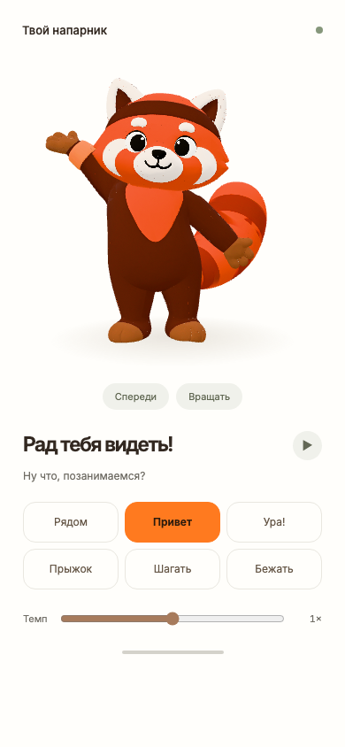

# Красная панда в 3D

26 сентября 2026. Рабочий эксперимент Meshy + Three.js: выбранная панда с тёмной повязкой, шесть движений, вращение, пауза, скорость и плавные переходы.

## Посмотреть

Из корня репозитория:

```sh
python3 -m http.server 8766 --bind 127.0.0.1
```

Открыть http://127.0.0.1:8766/design-exploration/red-panda-3d/ . `file://` не подходит из-за загрузки модулей и GLB.

Просмотрщик использует локальный Three.js 0.180.0 и шрифт из `prototype/assets/fonts/`. CDN и доступ к аккаунту Meshy для просмотра не нужны. Размер экрана проверен на 320, 390 и 1200 px. На физическом iPhone не проверено.



## Файлы

- `reference/a-pose-v1.png` — референс, созданный встроенным Imagegen по утверждённому мастер-листу. Полный промпт в `prompts.json`.
- `assets/panda-v1.glb` — исходная модель, 249 138 треугольников.
- `assets/panda-20k.glb` — облегчённая версия, 20 660 треугольников.
- `assets/panda-rigged.glb` — исходный экспорт рига Meshy, 20 658 треугольников, 24 кости, 16 611 492 байта.
- `assets/{idle,wave,cheer,jump,walking,running}.glb` — исходные экспорты Meshy с движениями и моделью.
- `assets/clips/*.json` — только данные движений для Three.js; все шесть вместе около 2,2 MB вместо повторной загрузки модели на каждое движение.
- `manifest.json` — модель, движения, подписи и пути исходных GLB.
- `mascot-rig.js` — коррекция весов головы **в просмотрщике**.
- `viewer.js` — нормализация клипов и проигрывание. Ожидание, ходьба и бег зациклены; приветствие, радость и прыжок завершаются возвратом в ожидание. Переход — 0,3 секунды.

Важно при переносе: исходный GLB сохранён без изменений. Коррекция головы и смягчение движений применяются кодом просмотрщика, а не запечены в экспорт Meshy. Для такого же результата нужно перенести `preserveMascotHead` и `normalizeClip` либо повторить соответствующие правки в 3D-редакторе.

## Что пришлось исправить

1. Стандартная генерация дала слишком плотную для такого экрана сетку. Remesh уменьшил её примерно в 12 раз без заметной потери силуэта на мобильном экране.
2. На тесно расположенных UV-островах появлялись светлые швы при mip-фильтрации. В просмотрщике отключены mipmaps, оставлены линейная фильтрация и анизотропия; убраны лишние normal/roughness/metalness maps для гладкой стилизации.
3. Auto-Rig назначил большую часть головы правому плечу и руке. При приветствии лицо сжималось. `mascot-rig.js` привязывает 7179 вершин области головы к кости Head. Маска относится только к этой модели, не является универсальным алгоритмом.
4. Idle менял масштаб Hips до 1,17647. Масштаб костей зафиксирован по исходной позе. Повороты шеи и головы смягчены до 15%, Hips — до 30%; горизонтальное перемещение центрировано. Вертикальное движение сохранено для прыжка.
5. Исходная поза сохраняется отдельно до запуска первого клипа, поэтому адаптация движений не зависит от порядка нажатия кнопок.

## Ограничения

- Это пригодный для оценки интерактивный 3D-эксперимент, а не окончательный анимационный ассет приложения.
- Лицо статично: нет моргания, отдельных эмоций или управления ртом.
- Отдельной кости хвоста нет. Хвост следует за телом через автоматические веса; самостоятельное плавное виляние не сделано.
- Жесты основаны на человеческом mocap. На крупных ракурсах местами заметны остаточные артефакты текстур и деформации плеч.
- Основной GLB около 16,6 MB. Геометрия облегчена, но перед выпуском на мобильных устройствах ещё нужна оптимизация текстур/доставки и проверка частоты кадров на устройстве.
- Основной прототип приложения в этой работе не изменялся.

## История задач и стоимость

Проект Meshy: `meshy_output/20260926_212701_red-panda-v1_01a0de8a/`. Полные снимки ответов и связи — в этом каталоге; ссылки на удалённые ассеты имеют ограниченный срок действия, локальные файлы сохранены.

| Этап | Ресурс | Task ID | Фактически списано |
| --- | --- | --- | ---: |
| Модель | image-to-3d | 01a0de8a-5e74-73be-93ca-75019c2dc8a2 | 30 |
| Сетка | remesh | 01a0de8f-2a47-713a-ae8e-968eb8f6d57b | 5 |
| Риг, ходьба, бег | rigging | 01a0de91-cb73-76ba-b6da-306b73232720 | 5 |
| Ожидание, action 0 | animate | 01a0de93-fd26-763d-b334-b4779ab60a58 | 3 |
| Приветствие, action 28 | animate | 01a0de94-ab63-70cd-9114-f1f8f623da5e | 3 |
| Радость, action 59 | animate | 01a0de96-4271-757a-85b7-9f8da82d6184 | 3 |
| Прыжок, action 44 | animate | 01a0de96-db59-70c8-97ef-cf98952dfc18 | 3 |
| **Всего** | | | **52** |

Источник фактических списаний: `consumed_credits` завершённых задач. Баланс Meshy: 3153 → 3101. Стоимость встроенного Imagegen в эти 52 кредита Meshy не входит; инструмент её не сообщил. Прайс для предварительной оценки проверен 26.09.2026: https://docs.meshy.ai/en/api/pricing .

## Проверки

`evidence/verification.json`: пауза/продолжение, скорость, шесть движений, плавные переключения, возврат в idle после одноразовых реакций, вращение, reduced motion и отсутствие горизонтального переполнения на 320 px. Ошибок JavaScript и ответов HTTP ≥400 в проверке нет.

`evidence/final-report.json`: загрузка всех клипов, длительности, список костей и снимки трёх фаз каждого движения на 390×844. Дополнительно осмотрены боковой и задний ракурсы. Подсчёт полигонов сделан из индексных accessor-ов скачанного GLB, так как Meshy не вернул `face_count`; исходный ответ сервиса не изменялся.

Повторить (при работающем сервере):

```sh
node design-exploration/red-panda-3d/capture.cjs final
node design-exploration/red-panda-3d/verify.cjs
```

`extract-clips.cjs` повторно извлекает исходные анимационные данные из локальных GLB. `inspect-glb.cjs` считает геометрию и записывает SHA-256.

## Подача

Нейтральный зеленовато-серый фон `#EDF1ED`, сцена `#FFFEFB`, текст `#322820`, акцент `#FF7A1F`, вторичный текст `#706D65`. Шрифт Inter из проекта. На десктопе — референс рядом с телефоном; на мобильном экране всё пространство отдано персонажу и его движениям.
