# Прототип Fresh — «живая» версия с красной пандой

27 сентября 2026. Копия `prototype/` с новой визуальной оболочкой, маскотом и анимациями.
Исходный `prototype/` сохранён. Доработки по плану выполняются только в этой копии.

Следующий этап работ: [CODEX-PLAN.md](CODEX-PLAN.md).

## Посмотреть

```sh
python3 -m http.server 8777 --bind 127.0.0.1
```

Открыть http://127.0.0.1:8777/prototype-fresh/

| Тренер · Сегодня | Клиент · Главная | Приглашение | Празднование |
| --- | --- | --- | --- |
| 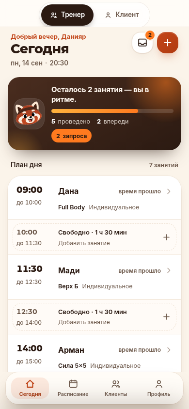 | 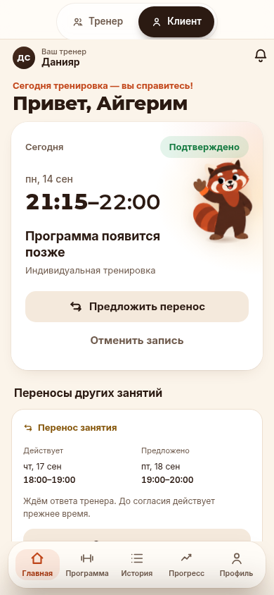 | 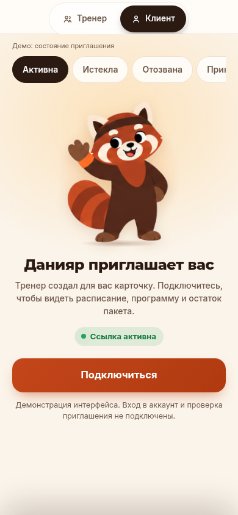 | 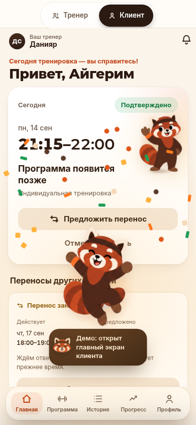 |

## Что изменилось

**Маскот.** 19 прозрачных спрайтов в `assets/mascot/`: 10 поз (`front`, `wave`, `thumbs`,
`jump`, `sit`, `clipboard`, `stretch`, `sleep`, `side`, `three-quarter`) и 8 лиц (`face-*`).
Все вырезаны из утверждённого мастер-листа
`design-exploration/mascot-sheets-2026-09-26/red-panda-dark-headband.png`: фон удалён
заливкой от краёв, края сглажены без светлой каймы. Персонаж не перерисовывался.
Прежние кадры по CSS-координатам и `mix-blend-mode: multiply` больше не нужны.

Где появляется панда:

- «Сегодня» у тренера: приветствие по времени суток и тёмная карточка-сводка. В ней
  спокойное лицо панды, есть прогресс дня и кнопка входящих запросов.
- Главная клиента: машущая панда в hero-карточке, с планшетом, если нужен ответ.
- Приглашение, пустые состояния (спит / сидит), журнал без выбранного занятия.
- Тосты: обычная иконка; лицо панды только после празднования.
- Празднование с конфетти и прыгающей пандой после подключения, завершения тренировки,
  а обычные подтверждения остаются тостами.
- Логотип в боковом меню и favicon.

**Анимации** (`css/fresh.css`, `js/fx.js`):

- Появление экрана с каскадом блоков. Запускается только при смене экрана, роли
  или сценария, а не при каждом перерисовывании.
- Для каждой позы свой цикл: покачивание, дыхание, взмах, кивок, прыжок, сон с «z».
  Тень под пандой синхронизирована с циклом. По клику панда подпрыгивает.
- Пружинные нажатия кнопок, блик на основной кнопке, парящий таб-бар
  с «пузырём» активного пункта, рост прогресс-баров, мерцающие скелетоны,
  пружинный выезд листов и тостов.
- `prefers-reduced-motion`: все движения и эффекты отключаются.

**Палитра** взята из персонажа: кремовый фон, шоколадный текст и тёмные карточки,
ржаво-оранжевый акцент. Проверено по WCAG AA: белый на кнопке 4,96:1, акцент на белом 5,02:1,
вторичный текст на фоне 5,95:1, активная вкладка 5,5:1.

## Палитры

Переключатель «Палитра» на панели прототипа или параметр `?palette=`:

| Параметр | Палитра | Акцент | Идея |
| --- | --- | --- | --- |
| — | **Чернила (по умолчанию)** | `#2b48d6` | акцент исходного прототипа, графит, янтарные бейджи |
| `teal` | Бирюза | `#0f766e` | нейтральная основа; оранжевый только у маскота |
| `panda` | Панда | ржаво-оранжевый `#c2461a` | всё в цветах персонажа |

Во всех трёх оранжевый остаётся у панды, её свечения и празднования. Акцент, кнопки,
вкладки, прогресс и тёмная карточка меняются через токены в начале `css/fresh.css`.
Все пары текст/фон проверены на WCAG AA (белый на кнопке: 4,96 / 5,19 / 6,56).
Сравнение: `review/palettes/`.

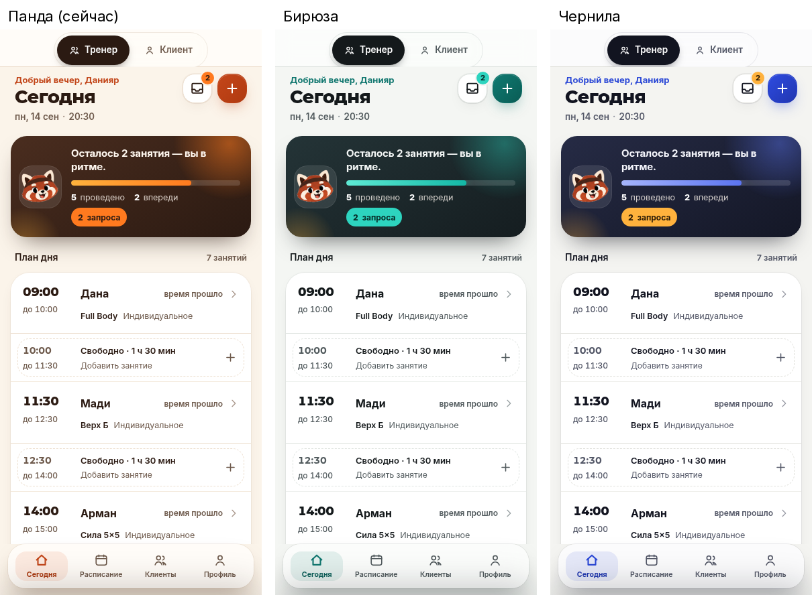

### Тёмная тема

Тренер по умолчанию видит тёмную тему, клиент — светлую; журнал тренировки всегда тёмный.
Выбор «По роли / Тёмная / Светлая» — в профиле или через `?theme=dark|light|auto`.
Графитовые поверхности взяты из «Инструмента», шрифты, скругления и панда — как в текущем виде.
Для каждой палитры акцент в тёмной теме осветлён ради контраста. Токены: `css/theme-dark.css`.

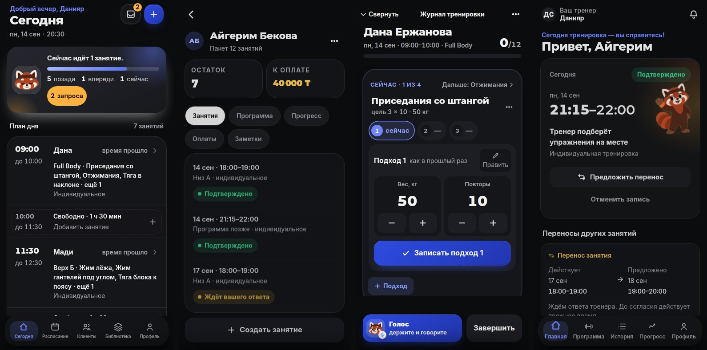

### Первый вход тренера

Приветствие и три коротких шага: имя и направление, рабочие дни и часы, первый клиент.
Любой шаг можно пропустить; клиент с приглашением уходит в свой сценарий «Первый вход».
Итоговый экран ведёт к созданию первого занятия. Экран `t-welcome`, код — `js/screens/welcome.js`.

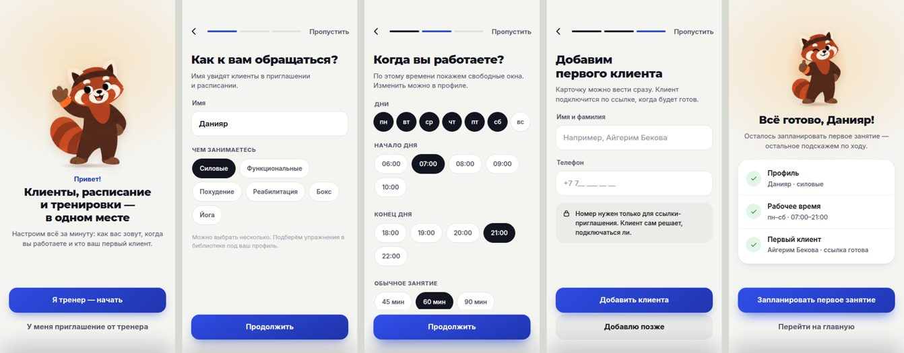

## Проведение тренировки: один подход в фокусе

28 сентября 2026. Экран журнала переделан под то, как тренер работает в зале: телефон в одной руке,
клиент под штангой, между подходами минута-полторы.

Раньше на экране помещалось одно упражнение: все подходы всех упражнений шли одним длинным списком
одинаковых строк «Как в прошлый раз / Записать…», а нижняя панель занимала пятую часть экрана.
Теперь экран отвечает на два вопроса: **что делаем сейчас** и **что дальше**.

| Начало | Отдых после подхода | Следующее упражнение | Список | Мини-группа | 320 px |
| --- | --- | --- | --- | --- | --- |
| 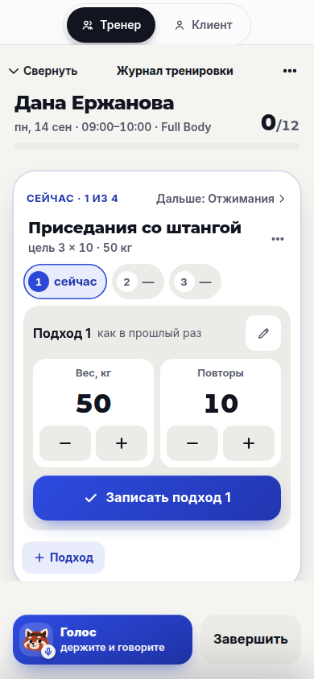 | 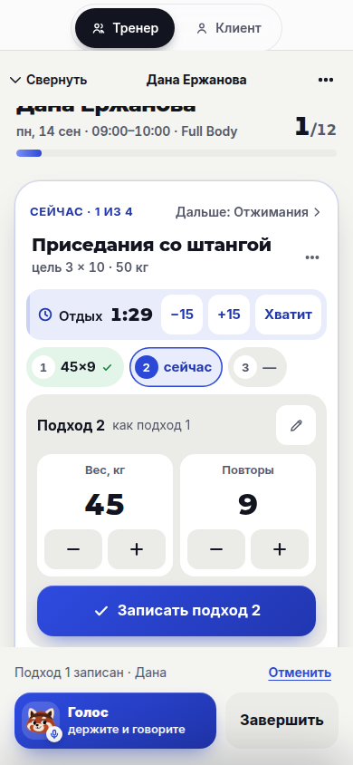 | 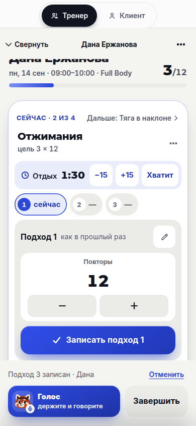 | 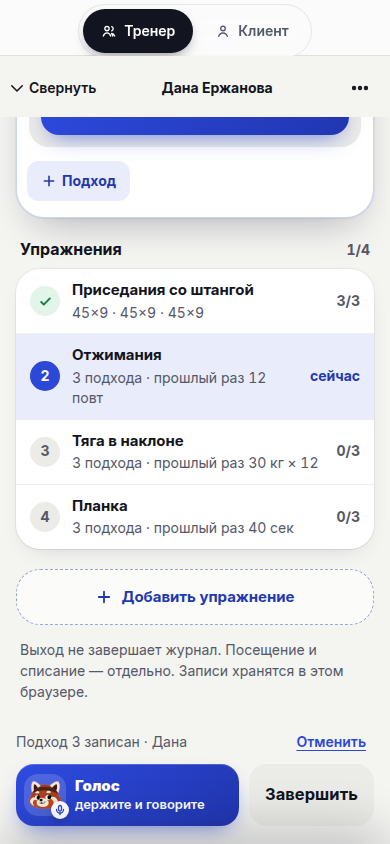 | 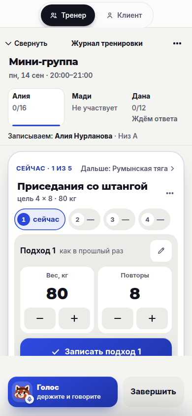 | 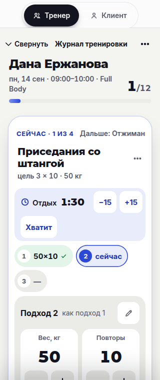 |

- **Карточка «Сейчас».** Текущее упражнение: название, цель, подходы чипсами (записанные — с галочкой,
  текущий — «сейчас», черновики — жёлтые). Нажатие на чипс открывает прежний подробный лист правки.
- **Ввод прямо в карточке.** Вес и повторы (или секунды для планки) уже подставлены: из черновика,
  иначе из предыдущего подхода сегодня, иначе как в прошлый раз, иначе по плану. Кнопки −/+ меняют вес
  на 2,5 кг, повторы на 1, секунды на 5. Одна кнопка «Записать подход N»; Enter в поле тоже записывает.
  Значение можно впечатать, ошибка показывается под полями.
- **Отдых.** После записи запускается таймер: 90 с, 60 с для упражнений без веса. −15 / +15 запоминаются
  для этого упражнения до конца тренировки. По окончании телефон вибрирует, полоса становится зелёной
  и считает перерыв сверх отдыха. Таймер свой у каждого участника мини-группы и живёт только во вкладке.
- **Переход дальше.** Когда подходы упражнения записаны, карточка сама переключается на следующее.
  «Дальше: …» в углу позволяет перейти раньше, строка в списке — открыть любое упражнение.
  Когда записано всё, карточка предлагает завершить тренировку.
- **Список «Упражнения».** Одна строка на упражнение: номер или галочка, записанные значения
  («45×9 · 45×9»), счётчик 2/3, текущее выделено, пропущенные зачёркнуты, есть отметка черновика.
- **Нижняя панель** в одну строку: «Голос — держите и говорите» и короткое «Завершить».
  Голос, замены, пропуски и добавление упражнений работают как раньше; добавленное или новое
  упражнение сразу становится текущим.
- **Отмена.** После записи под экраном «Подход N записан · Дана — Отменить», как было у быстрой записи.
- Экран результатов после завершения не менялся: полные карточки со всеми подходами.

Файлы: `js/workout.js` (текущее упражнение, подстановка значений, таймер отдыха, запись из карточки),
`Store.logging.record` в `js/store.js`, `session()` в `js/screens/trainer.js`, стили `.w*` в конце
`css/fresh.css`. Тесты: `tests/workout.test.cjs`.

Проверено в Chromium: 390, 360 и 320 px, крупный шрифт 20px, спокойный режим, мини-группа.
Значения до «102,5» помещаются, горизонтальной прокрутки нет, кнопка «Записать» после записи
остаётся над панелью. На телефоне и в зале не проверялось.

### Свёрнутая тренировка

Плашка «Вернуться к тренировке» стала тёмным мини-плеером высотой 64 px вместо белой карточки
на четыре строки. Она почти не закрывает план дня. В ней кольцо прогресса, имя и счёт подходов,
текущее упражнение, а во время отдыха — живой таймер и «дальше …». Нажатие открывает журнал.
Если места мало (узкий экран или крупный шрифт), кнопка «Вернуться» сжимается до стрелки.
Ошибка сохранения, «Участник не участвует» и «Без программы» показываются так же, как раньше.

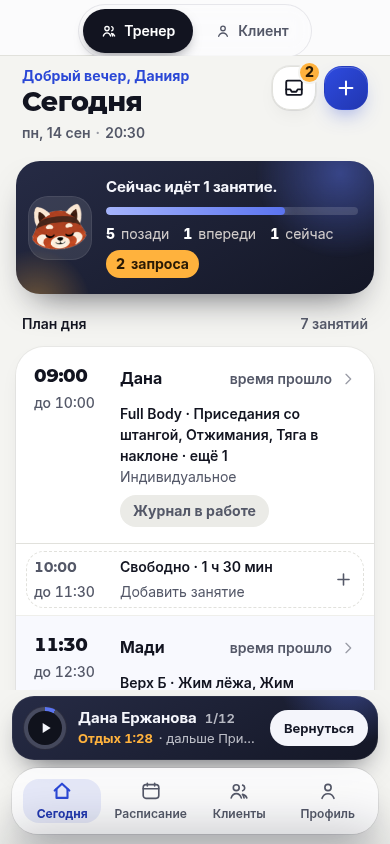

## Голосовой ввод в журнале тренировки

Кнопка «Голос» рядом с «Завершить» работает как рация: **удерживайте и говорите**.
Пока кнопка зажата, из-за неё выглядывает панда с планшетом. Она наклоняет голову и
«слушает», в облачке — живой текст и уже понятые записи. Отпустили — панда «разбирает»,
показывает «Понял: 3 записи» с большим пальцем, и открывается компактный лист
«Проверьте запись». Если ничего не слышно или нет доступа к микрофону, панда пожимает плечами
и объясняет, что случилось. Короткое нажатие открывает полный лист с текстовым полем и
демо-фразами. С клавиатуры — удерживать пробел или Enter, Escape отменяет.

| Кнопка | Слушает | Понятые фразы | Понял | Проверка |
| --- | --- | --- | --- | --- |
| 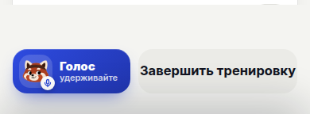 | 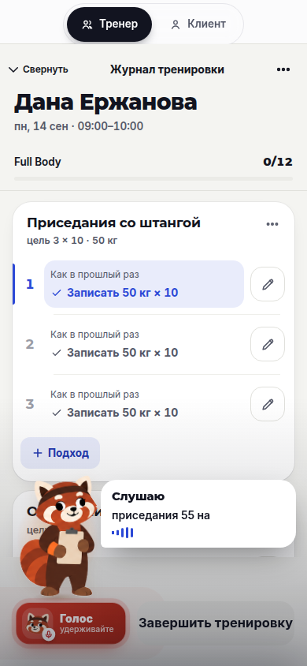 | 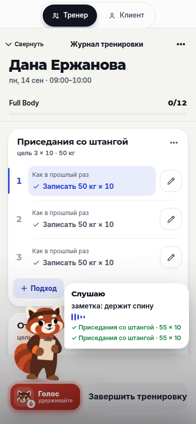 | 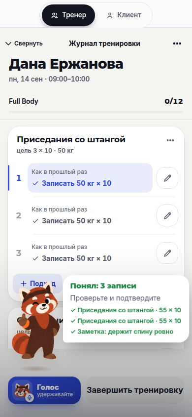 | 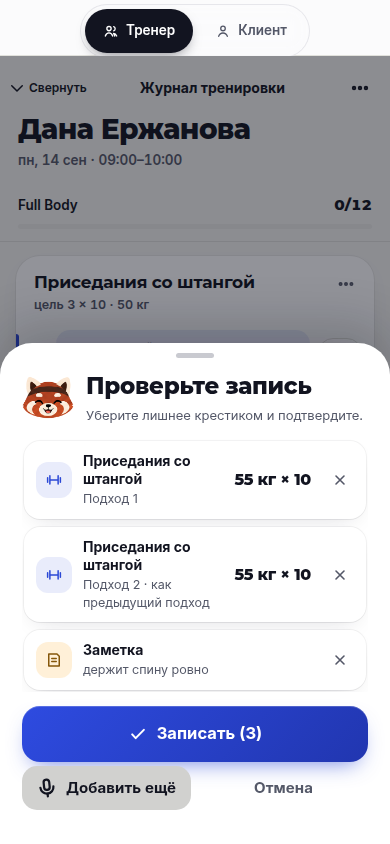 |

Тренер говорит обычными фразами:

| Фраза | Что получится |
| --- | --- |
| «Приседания 80 на 8» | следующий пустой подход приседаний: 80 кг × 8 |
| «80 на 10» | следующий пустой подход текущего упражнения |
| «Ещё один такой же» | копия предыдущего подхода |
| «Отжимания 15 раз», «планка 45 секунд» | упражнения без веса |
| «Тяга второй подход 35 на 10» | конкретный подход, с пометкой «заменит записанный» |
| «Арман, жим 45 на 8» | в мини-группе — подход другому участнику |
| «Заметка: колено уходит внутрь» | заметка тренера к занятию |

Числа словами («восемьдесят два с половиной») распознаются. Распознанное показывается
карточками; в журнал ничего не пишется, пока тренер не нажмёт «Записать», любую
карточку можно убрать. Неизвестное упражнение, заполненное упражнение или непонятная
фраза показываются как ошибка и не записываются.

Распознавание — Web Speech API браузера (`ru-RU`). Где его нет или микрофон запрещён,
работает текстовое поле. Демо-фразы «надиктовываются» с анимацией, поэтому сценарий
можно показать на любом устройстве. В Chrome звук обрабатывается на серверах Google —
это сказано в листе. Заметки хранятся в журнале занятия (`notes`) рядом с подходами.

| Диктовка | Распознано | Журнал |
| --- | --- | --- |
| 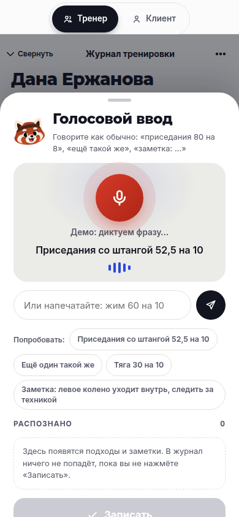 | 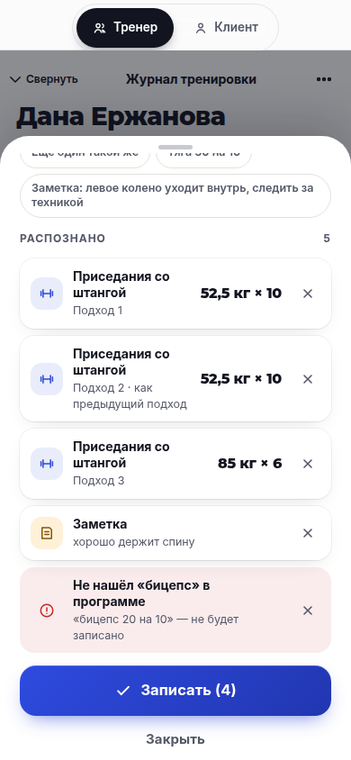 | 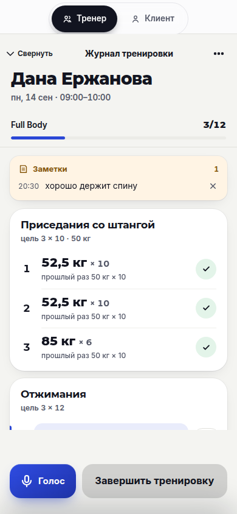 |

## Гибкий журнал: план и факт

Программа — план, журнал — факт. На тренировке тренер меняет факт как угодно,
программа клиента при этом **не меняется**.

| Действие | Где | Как видно |
| --- | --- | --- |
| Лишний подход | «+ Подход» под упражнением, меню «⋯» | «сверх плана» у подхода |
| Убрать пустой лишний подход | «− Убрать пустой» | — |
| Заменить упражнение | меню «⋯» → «Заменить» | «↔ вместо …»; записанные подходы остаются у старого |
| Пропустить | меню «⋯» → «Пропустить», можно «Вернуть» | зачёркнуто, «пропущено» |
| Добавить упражнение | «+ Добавить упражнение» | «+ не из программы» |
| Тренировка без программы | журнал стартует пустым | «Добавить упражнение» |

Выбор упражнения — поиск по библиотеке (`DB.exerciseLibrary`, 80 упражнений). Своё упражнение
создать можно, но кнопка стоит под найденными и становится тише, если похожие есть:
так меньше дублей вроде «Бицепс» и «Сгибания на бицепс». Изменения — только для текущего
участника мини-группы.

Голос понимает то же самое: «вместо тяги делаем жим гантелей», «пропускаем планку»,
«бицепс 12 на 12» (найдёт «Сгибания на бицепс с гантелями» или предложит своё),
«приседания 60 на 8», когда все подходы уже записаны (станет подходом сверх плана).
«Ещё такой же» и «80 на 10» без названия относятся к последнему названному упражнению.
Всё по-прежнему подтверждается кнопкой «Записать».

При завершении и в результатах — сводка «Отличия от программы: заменено 1 · добавлено 2 ·
пропущено 1». Обновить личную программу можно отдельным действием после завершения: тренер выбирает
изменения галочками, общий шаблон остаётся прежним.

Модель данных: у упражнений журнала появились `origin` (`added` / `replaced`), `replaces`,
`skipped`, `replacedBy`, `plannedSets`, `unit`. Старые журналы читаются без миграции.

| Меню | Поиск | Замена | Голос | Добавлено | Итоги |
| --- | --- | --- | --- | --- | --- |
| 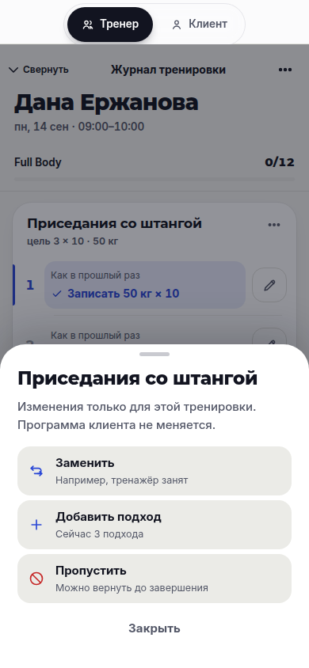 | 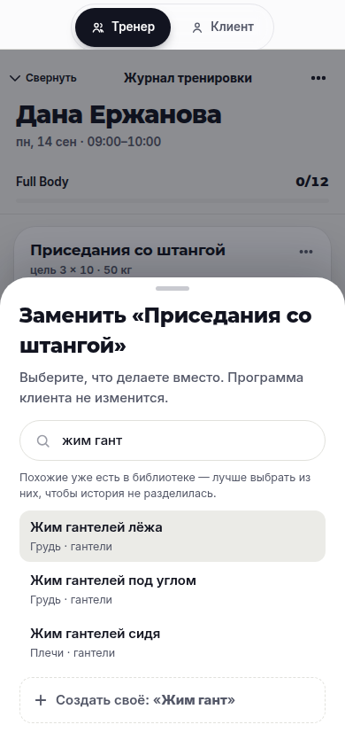 | 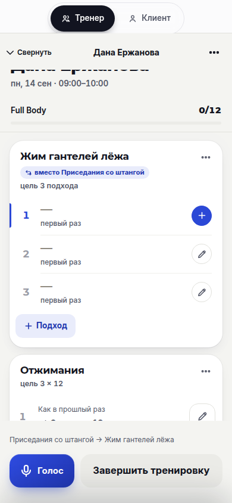 | 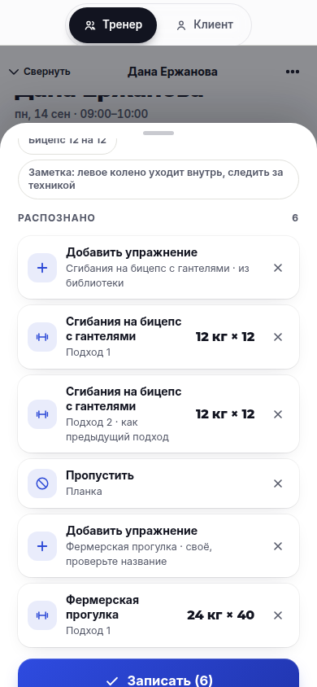 | 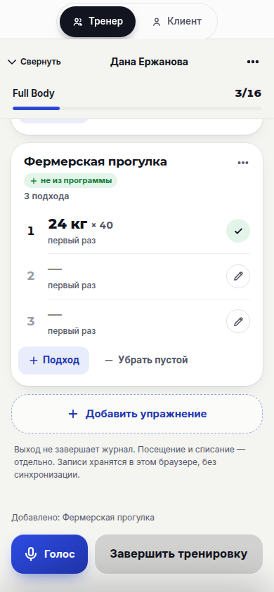 | 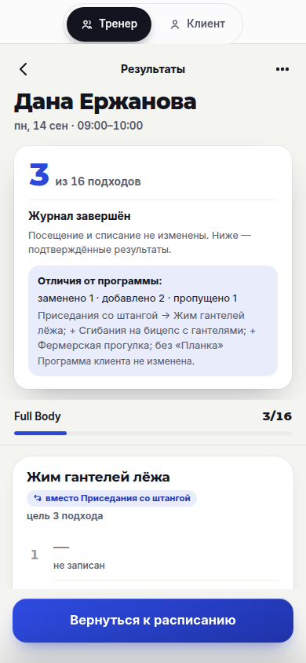 |

## Файлы

| Файл | Роль |
| --- | --- |
| `css/fresh.css` | токены и переопределения поверх исходных стилей, все анимации |
| `js/mascot.js` | `Mascot.render(pose, context)` и `Mascot.face(mood, size)` |
| `js/fx.js` | празднование, искры при записи подхода, реакция на клик |
| `js/voice.js` | `VoiceParse` (разбор фраз) и `Voice` (распознавание, лист, запись) |
| `js/flex.js` | поиск по библиотеке, выбор и создание упражнения |
| `js/workout.js` | текущее упражнение журнала, подстановка значений, таймер отдыха |
| `js/app.js` | флаги `is-entering` / `is-fresh` и вызов `Fx.afterAction` |
| `js/screens/*.js`, `js/ui.js` | места появления панды, сводка дня |

## Проверка

- `node --test prototype-fresh/tests/*.test.cjs`: 100/100, включая 13 тестов разбора фраз и 5 тестов гибкого журнала. Загрузчики тестов теперь
  подключают `mascot.js`, потому что экраны используют маскота.
- Снимки Chromium 390×844 и 1440×960 в `review/`. Физический iPhone не проверялся.
- e2e-спеки не скопированы: они проверяют статичные кадры исходного прототипа.

## Задача 1 · Единые снимки и сводка дня

Все иллюстрации выше (кроме намеренного сравнения палитр) пересняты в «Чернилах».
Сводка различает занятия позади, идущие сейчас и будущие. «Позади» означает время
в расписании, а не факт посещения. Метка прошедшего времени учитывает дату.

Повторить при запущенном сервере: `node prototype-fresh/tests/shoot.mjs`.
Список кадров и действий задан массивом в скрипте. Каждый кадр начинает с чистого
хранилища; демо-время — 18:45. Оба размера находятся в `review/01-ink/`, мобильные
копии обновляют прежние ссылки README. `CHROMIUM_PATH` задаёт путь к браузеру;
`PROTOTYPE_URL` — адрес сервера. Новый браузер не скачивается.

Проверка: `node --test prototype-fresh/tests/*.test.cjs`, 101 тест.
Распознавание речи на снимках имитируется; реальный микрофон и физический телефон
не проверены. Скриншоты не доказывают качество распознавания в зале.

## Задача 2 · Спокойный интерфейс

В профилях обеих ролей есть независимый переключатель «Спокойный интерфейс»;
`?calm=1` включает его для демонстрации. Значения сохраняются в браузере.
Панда в этом режиме статична и остаётся только в приглашении и пустых экранах;
в голосовом оверлее — микрофон и полосы громкости. Обычный режим показывает
спокойное лицо в сводке. Празднование осталось у завершения тренировки (включая
неполный журнал) и первого подключения; оплата, подтверждения и голос дают тост.
Лицо в тосте появляется только после празднования. Reduced motion действует отдельно.

Проверка: 104 unit-теста; `node prototype-fresh/tests/shoot.mjs 02-calm`.
Обычные и спокойные кадры обоих размеров: `review/02-calm/` и `review/02-calm/calm/`.

| Сегодня | Спокойный режим |
| --- | --- |
| 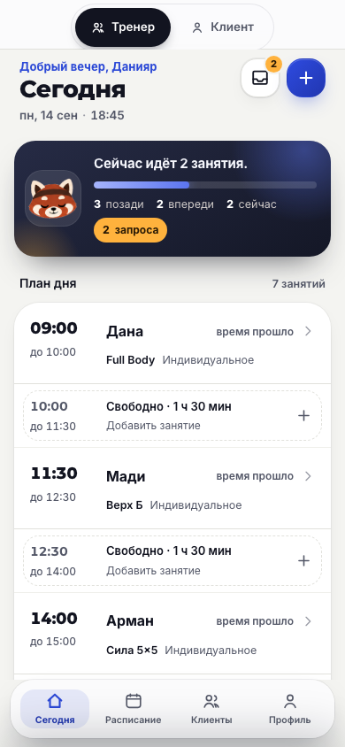 | 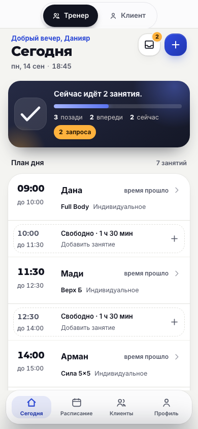 |

Хранилище с запретом записи проверяется защитой try/catch; физические устройства
и субъективное восприятие маскота пока не проверены.

## Задача 3 · Сохраняемые упражнения

Библиотека содержит 80 упражнений по восьми группам. Поиск и голос понимают
разговорные названия: «становая», «бицуха», «присед», «планочка».
Свои упражнения сохраняются в `trainer-prototype:exercises:v1`; регистр, «ё»,
пробелы и дефисы не создают дубли. В профиле тренера → «Мои упражнения» можно
удалить запись из библиотеки, сохранив её в прошлых журналах.

Проверка: 106 unit-тестов, включая перезагрузку, повреждённое хранилище, дубли
и голосовые псевдонимы. `node prototype-fresh/tests/shoot.mjs 03-exercises`;
кадры обоих размеров — `review/03-exercises/`.

| Поиск по «бицуха» | Свои упражнения |
| --- | --- |
| 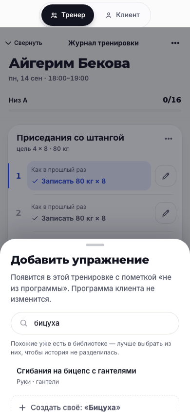 | 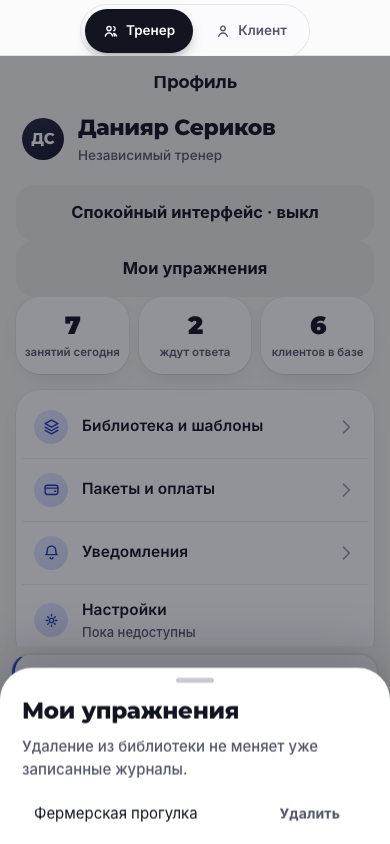 |

Не проверены распознавание реальной речи в шуме и удобство названий с тренерами.

## Задача 4 · Личная программа после тренировки

В результатах тренировки с изменениями доступно «Обновить программу клиента».
Выберите галочками замены, добавления, пропуски и записанные подходы сверх плана.
Пропуски и лишние подходы изначально выключены. Сохранение создаёт личную копию
в `trainer-prototype:client-programs:v1`; шаблоны и остальные клиенты не меняются.
В мини-группе сначала переключитесь на нужного участника. Новые упражнения
получают прошлые значения из последнего записанного подхода этой тренировки.
Копия привязана к программе, из которой сделана: у клиента может быть своя «Низ А» и своя «Верх Б».
Занятия с другой программой открываются по её шаблону, а занятия без программы — по копии,
сохранённой из тренировки без программы, если она есть. Старый формат хранилища (одна копия
на клиента, `version: 1`) читается как копия своей программы. Открытые и прошлые журналы
сохраняют свой снимок упражнений.

Проверка: 108 unit-тестов; `node prototype-fresh/tests/shoot.mjs 04-programs`.
Снимки результатов, галочек и программы клиента — `review/04-programs/`.

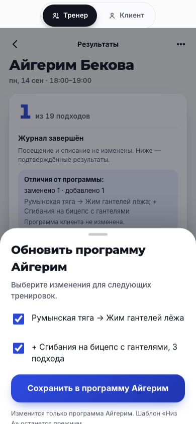

Не проверено параллельное редактирование личной программы в разных вкладках;
синхронизации между устройствами нет.

## Задача 5 · Результаты и заметки для клиента

На главной показаны программа, первые три упражнения и число остальных.
Без программы клиент видит «Тренер подберёт упражнения на месте»; тренер может
выбрать программу занятия. Уже открытый журнал сохраняет свой снимок плана.
«Прогресс» строится по завершённым сохранённым журналам: лучший вес и повторы
того же подхода, прирост относительно лучшего результата, известного 28 дней назад.
Если исходной записи нет, сравнение не выдумывается. Для упражнений без веса
сравниваются повторы или секунды. История показывает отличия от плана и только
заметки с включённым «Видно клиенту». Новые и старые заметки закрыты по умолчанию.

Проверка: 110 unit-тестов, включая прирост +10 кг, фильтрацию закрытых заметок
и пустые состояния. `node prototype-fresh/tests/shoot.mjs 05-client-value`;
кадры — `review/05-client-value/`. Серверные права доступа пока не реализованы:
это разделение отображения в одном браузере, не авторизация.

| Прогресс | История |
| --- | --- |
| 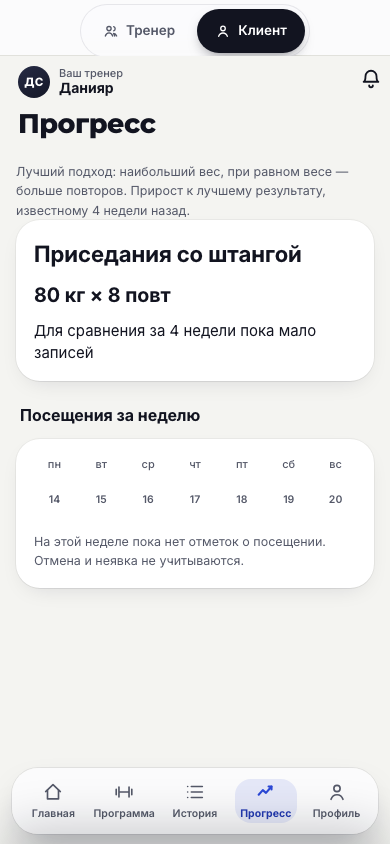 | 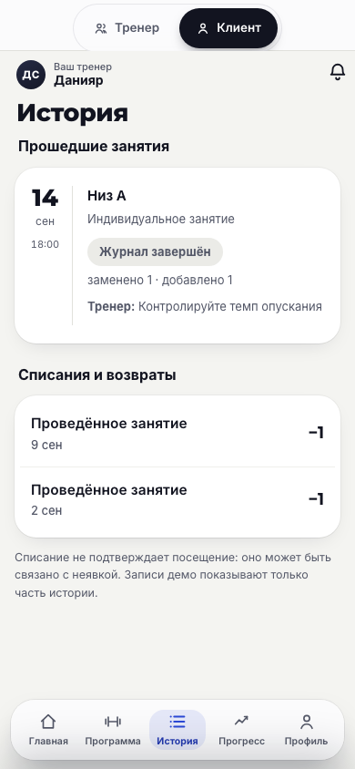 |

## Задача 6 · Полевые замеры

`?field=1` включает локальный журнал событий. Профиль тренера позволяет выгрузить
JSON или очистить журнал. Без параметра событий и записи хранилища нет.
Сохраняются начало/отпускание голоса, распознанный текст, разобранные пункты,
удаления, ошибки и подтверждение; для ручного ввода — открытие листа и сохранение.
«Как в прошлый раз» измеряется от первого нажатия и вынесено в отдельную метрику:
его короткое время нельзя смешивать с вводом веса и повторов.

Выгрузка содержит среднее полное время попыток, делённое на число сохранённых
подходов. Демо и текстовые фразы исключены из среднего голоса. Доля фраз без правок
считает только подтверждённые попытки без удалений, ошибок и ручного ввода.
Отменённые попытки сохраняются, но не входят во время успешного подхода.
Протокол сравнения будет в `research/gym-test.md` (задача 8).

Проверка: 112 unit-тестов, включая отключённый режим и синтетическую сводку.
`node prototype-fresh/tests/shoot.mjs 06-field`, кадры — `review/06-field/`.
Реальные замеры в зале не проводились. Журнал событий не отправляется на сервер;
само распознавание речи зависит от сервиса браузера.

## Задача 7 · Крупный текст

Размеры текста переведены в rem; минимальный размер — 14px при корне 16px.
Кнопки растут по содержимому. При узкой ширине карточки, подписи, бейджи и календарь
переносятся, а экран журнала прокручивается целиком: нижние действия не скрывают
подходы. На кнопке голоса явно написано «удержать — голос / нажать — текст».

Проверка: 112 unit-тестов; `node prototype-fresh/tests/shoot.mjs large-text`.
Сняты 18 экранов и редактор подхода при корне 20px, в 390×844 и 1440×960.
Папка `review/large-text/zoom200/` содержит проверку компоновки при 195 CSS px
с плотностью 2: итоговый кадр 390×844 соответствует доступной ширине при 200%.
Это эмуляция компоновки, не проверка системного увеличения текста на iPhone.
`audit.json` не обнаружил переполнений содержимого; декоративные круги, бейдж
входящих и штатно прокручиваемое поле ссылки исключены из геометрической проверки.

| 20px | Компоновка при 200% |
| --- | --- |
| 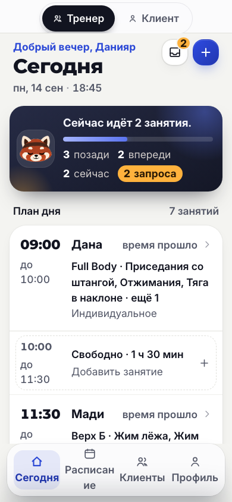 | 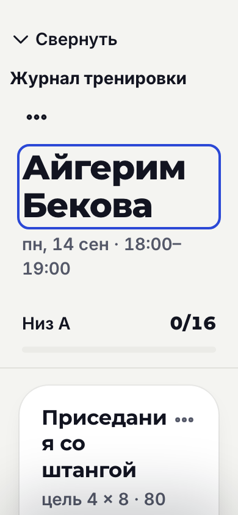 |

Проверка с физическим телефоном, системным крупным текстом и экранным диктором
остаётся частью полевого протокола. Автоматическая геометрия не заменяет её.

## Задача 8 · Материалы исследования

В `research/` подготовлены [интервью тренера на 30 минут](research/interview-trainers.md),
[интервью клиента на 15 минут](research/interview-clients.md),
[протокол 2 × 3 тренировок](research/gym-test.md) и [шаблон выводов](research/findings-template.md).
Протокол меняет порядок голоса и касаний между тренерами, учитывает шум, язык,
телефон, ошибки и отказы; быстрый повтор анализируется отдельно.

Проверка: временные блоки составляют 30 и 15 минут, ссылки проверены;
112 unit-тестов проходят. Экраны в этой задаче не менялись — новые скриншоты
не требуются. Интервью и полевые тренировки ещё не проведены; шаблон пустой.

## Задача 9 · Проект синхронизации

[SYNC-DESIGN.md](SYNC-DESIGN.md) перечисляет все фактические ключи браузера,
сущности, офлайн-требования, варианты конфликтов двух устройств и три варианта
хранения: Supabase, Firestore, собственный API. Цены и свойства сверены с официальными
источниками; ссылки находятся рядом с утверждениями. Палитра сейчас живёт в URL,
а не в localStorage — это отдельно отмечено.

Решения о бэкенде, размещении данных, входе и конфликтах оставлены владельцу;
вопросы добавлены в конец плана. Реализации и новых зависимостей нет.
Проверка: инвентаризация ключей и ссылок, 112 unit-тестов. Изменены только документы,
поэтому новых экранов для съёмки нет. Стоимость под реальную нагрузку и восстановление
двух устройств не проверялись.

## Исправление четырёх проблемных страниц — 28 сентября 2026

- В листе занятия имя и статус занимают всю доступную ширину; кнопки посещения вынесены ниже. Убрано повторение типа занятия, пояснение о списании стало компактнее.
- Во входящих пустое состояние стало небольшой карточкой с пандой. История показывает полное имя, один статус и даты со временем.
- В списке клиентов остаток пакета записан одной фразой. Подписи навигации не разрываются; при крупном шрифте пункты переходят в два ряда.
- Завершённый журнал показывает только сохранённые подходы. Пустой журнал объясняет отсутствие результатов, черновики явно не учитываются. Данные плана и записи не удаляются.

Проверка: `node --test prototype-fresh/tests/*.test.cjs` — **114/114**. Добавлены проверки пустого и частичного журнала, включая несохранённое изменение уже записанного подхода. Скриншоты: 390×844 и 1440×960, корневой шрифт 16 и 20 px; также снят лист мини-группы.

Повторить снимки: `node prototype-fresh/tests/shoot.mjs 10-page-fixes` при локальном сервере на порту 8777.

[Занятие](review/10-page-fixes/attendance-390.png) · [Входящие](review/10-page-fixes/inbox-390.png) · [Клиенты](review/10-page-fixes/clients-390.png) · [Пустой журнал](review/10-page-fixes/results-empty-390.png) · [Частичные результаты](review/10-page-fixes/results-partial-390.png) · [Крупный шрифт](review/10-page-fixes/large/clients-390.png).

Дополнительно пройден браузерный сценарий на ширинах 320, 390 и 1440 px со шрифтом 16/20 px: подписи навигации целиком, отметка посещения через подтверждение без списания, завершение пустого журнала и возврат в расписание. Ошибок JavaScript нет. Физический телефон в эту проверку не входил.

## Исправленный взгляд панды — 28 сентября 2026

Сидящая панда смотрит в одном направлении обоими глазами. Заменён [ассет sit.png](assets/mascot/sit.png), который используется во входящих и других пустых состояниях. Поза и выбранные аксессуары сохранены, фон прозрачный. Правка выполнена встроенным `image_gen`; [промпт и происхождение](assets/mascot/sit-edit.md).

Проверка: **114/114 тестов**, визуальная проверка [входящих на телефоне](review/11-panda-eyes/inbox-390.png) и [в макете устройства](review/11-panda-eyes/inbox-1440.png). Повторить снимки: `node prototype-fresh/tests/shoot.mjs 11-panda-eyes`.

## Видео маскота — 29 сентября 2026

В первый вход тренера добавлены одноразовые `wave` и `thumbs`, в празднование —
`jump`. Остальные размещения сохраняют PNG. Видео загружается при появлении
соответствующего момента, после проигрывания остаётся постер. Спокойный режим,
уменьшение движения и ошибки воспроизведения обработаны.

[Ассеты и ограничения](assets/mascot/video/README.md) ·
[Браузерная проверка](tests/mascot-video.browser.cjs) ·
[Снимки и отчёт](review/12-mascot-video/).

Проверено: 137 unit-тестов; общий прогон instrument — 228 состояний экранов,
9 групп сценариев, без ошибок и переполнений. Целевой прогон проверяет однократное
воспроизведение, сохранение при перерисовке, WebP-fallback, ошибку загрузки,
спокойный режим и уменьшение движения. Safari/iPhone отдельно не проверялись.
